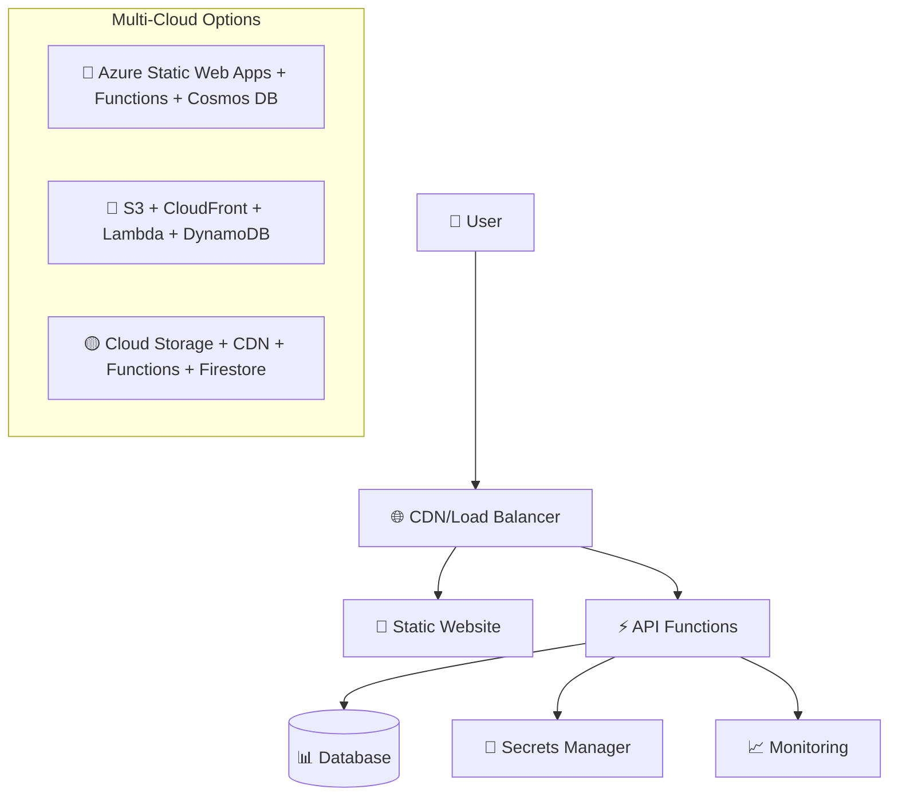

# 🚀 D Mac Portfolio

> **A comprehensive multi-cloud portfolio website showcasing modern DevOps practices across Azure, AWS, and GCP.**

[](https://github.com/developedbydmac/dmac-portfolio/actions/workflows/deploy-azure.yml)
[](https://github.com/developedbydmac/dmac-portfolio/actions/workflows/deploy.yml)
[](https://github.com/developedbydmac/dmac-portfolio/actions/workflows/deploy-gcp.yml)

## 🌟 **Features**

- **💼 Professional Portfolio**: Modern, responsive design with tech-focused theming
- **☁️ Multi-Cloud Architecture**: Deploy to Azure, AWS, or GCP with feature parity
- **🔧 Serverless Backend**: API functions for visitor tracking and contact forms
- **🏗️ Infrastructure as Code**: Complete Bicep and Terraform templates
- **🚀 CI/CD Pipelines**: Automated deployment with security scanning
- **📊 Monitoring & Analytics**: Comprehensive observability across all clouds
- **🔐 Security-First**: Best practices with secrets management and encryption

## 🌐 **Live Demos**

| Cloud Provider | Website URL | Status |
|----------------|-------------|---------|
| **🔷 Azure** | [dmac-portfolio.azurestaticapps.net](https://dmac-portfolio.azurestaticapps.net) | 🟢 Primary |
| **🔶 AWS** | [CloudFront URL](https://your-cloudfront-url.cloudfront.net) | 🟡 Secondary |
| **🟡 GCP** | [Global Load Balancer IP](https://your-gcp-ip.address) | 🟡 Secondary |

## 🏗️ **Architecture Overview**



## 🚀 **Quick Start**

### **1. Choose Your Cloud**
```bash
# Deploy to Azure (Recommended - Most comprehensive)
cd devops/azure && az deployment create --template-file bicep/main.bicep

# Deploy to AWS
cd devops/aws/terraform && terraform apply

# Deploy to GCP  
cd devops/gcp/terraform && terraform apply

# Deploy to ALL clouds
./devops/scripts/multi-cloud-deploy.sh
```

### **2. Local Development**
```bash
# Clone and setup
git clone https://github.com/developedbydmac/dmac-portfolio.git
cd dmac-portfolio

# Start local development server
./build.sh

# Test components
./test-components.sh
```

## 📁 **Project Structure**

```
dmac-portfolio/
├── 📄 Core Website Files
│   ├── index.html              # Main landing page
│   ├── resume.html             # Professional resume
│   ├── projects.html           # Project showcase
│   ├── blog.html              # Blog/articles
│   └── experience/            # Detailed work experience
├── 🎨 Assets & Styling
│   ├── styles/main.css        # Modern tech-themed CSS
│   ├── assets/images/         # Optimized images
│   └── components/            # Reusable HTML components
├── ⚡ API Functions
│   └── api/
│       ├── visits/            # Visitor count tracking
│       └── contact/           # Contact form handler
├── ☁️ Multi-Cloud Infrastructure
│   └── devops/
│       ├── azure/             # Azure-specific resources
│       ├── aws/               # AWS-specific resources
│       ├── gcp/               # GCP-specific resources
│       └── scripts/           # Deployment automation
├── 🔄 CI/CD Pipelines
│   └── .github/workflows/     # GitHub Actions
└── 📚 Documentation
    ├── DEPLOYMENT.md          # Deployment guide
    └── MULTI-CLOUD-SETUP.md   # Multi-cloud strategy
```

## ☁️ **Multi-Cloud Support**

### **🔷 Azure (Primary - Most Comprehensive)**
- **Services**: Static Web Apps, Functions, Cosmos DB, Key Vault, App Insights
- **Features**: Advanced CI/CD, security scanning, monitoring dashboard
- **Cost**: ~$15-25/month
- **Best For**: Production deployments, enterprise features

**[📖 Azure Setup Guide →](devops/azure/README.md)**

### **🔶 AWS (Cost-Optimized)**
- **Services**: S3, CloudFront, Lambda, DynamoDB, Secrets Manager, CloudWatch
- **Features**: Serverless architecture, pay-per-use pricing
- **Cost**: ~$2-5/month  
- **Best For**: Cost-conscious deployments, AWS-first organizations

**[📖 AWS Setup Guide →](devops/aws/README.md)**

### **🟡 GCP (Global Scale)**
- **Services**: Cloud Storage, CDN, Functions, Firestore, Secret Manager, Monitoring
- **Features**: Global load balancer, advanced networking
- **Cost**: ~$19-25/month
- **Best For**: Global audience, Google ecosystem integration

**[📖 GCP Setup Guide →](devops/gcp/README.md)**

## 🔧 **Development**

### **Prerequisites**
- Modern web browser
- Git
- Node.js (for local development)
- Cloud CLI tools (optional, for deployment)

### **Local Development**
```bash
# Validate HTML structure
./test-components.sh

# Build optimized assets
./build.sh

# Start local server (multiple options)
python3 -m http.server 8000
# or
npx serve .
# or
php -S localhost:8000
```

### **API Integration**
The portfolio includes two API endpoints that work across all cloud providers:

```javascript
// Visitor count tracking
POST /api/visits
Response: { "success": true, "count": 1234 }

// Contact form submission  
POST /api/contact
Body: { "name": "...", "email": "...", "message": "..." }
Response: { "success": true, "messageId": "..." }
```

## 📊 **Monitoring & Analytics**

Each cloud deployment includes comprehensive monitoring:

- **📈 Performance Metrics**: Response times, error rates, throughput
- **👥 User Analytics**: Visitor counts, page views, geographic data
- **🚨 Alerting**: Automated notifications for errors or performance issues
- **📋 Logging**: Centralized logs for debugging and analysis

Access monitoring dashboards:
- **Azure**: Application Insights dashboard
- **AWS**: CloudWatch dashboard  
- **GCP**: Cloud Monitoring dashboard

## 🔐 **Security Features**

- **🔒 HTTPS Everywhere**: SSL/TLS encryption across all deployments
- **🗝️ Secrets Management**: No hardcoded credentials, secure secret storage
- **🛡️ Security Scanning**: Automated vulnerability scanning in CI/CD
- **🔑 Identity Management**: Least-privilege access with managed identities
- **🌐 CORS Protection**: Proper cross-origin resource sharing configuration

## 🎯 **Performance Optimizations**

- **⚡ CDN Distribution**: Global content delivery networks
- **🖼️ Image Optimization**: Compressed and responsive images
- **📱 Mobile-First Design**: Optimized for all device sizes
- **🧹 Code Minification**: Optimized CSS and JavaScript
- **🔄 Caching Strategies**: Intelligent browser and CDN caching

## 🤝 **Contributing**

1. **Fork** the repository
2. **Create** a feature branch (`git checkout -b feature/amazing-feature`)
3. **Commit** your changes (`git commit -m 'Add amazing feature'`)
4. **Push** to the branch (`git push origin feature/amazing-feature`)
5. **Open** a Pull Request

## 📄 **License**

This project is licensed under the MIT License - see the [LICENSE](LICENSE) file for details.

## 🙋‍♂️ **Contact**

**D Mac** - Professional DevOps Engineer & Cloud Architect

- 🌐 **Website**: [dmac-portfolio.azurestaticapps.net](https://dmac-portfolio.azurestaticapps.net)
- 💼 **LinkedIn**: [linkedin.com/in/developedbydmac](https://linkedin.com/in/developedbydmac)
- 📧 **Email**: Contact via website form
- 🐱 **GitHub**: [@developedbydmac](https://github.com/developedbydmac)

---

⭐ **Star this repo** if you find it helpful! It demonstrates modern DevOps practices and multi-cloud architecture patterns.